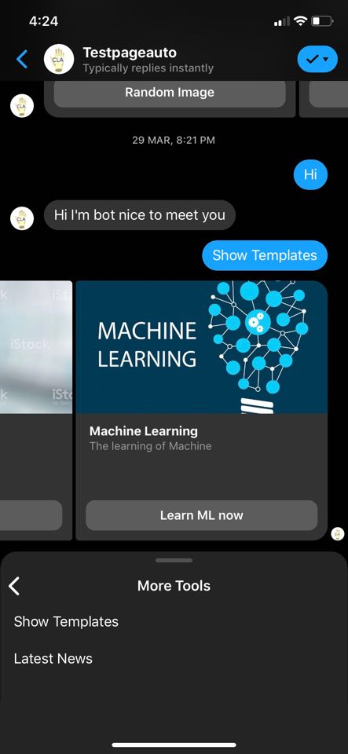
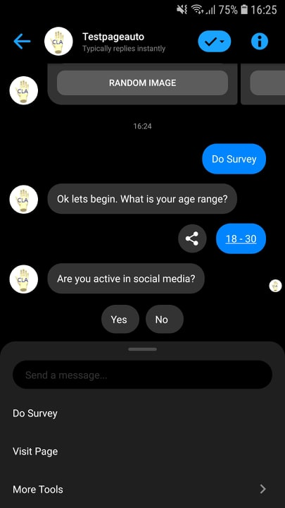

# Facebook Messenger Bot
This is a simple python template that uses Flask to build a webhook for Facebook's Messenger Bot API.

IOS             |  ANDROID
:-------------------------:|:-------------------------:

  
   

